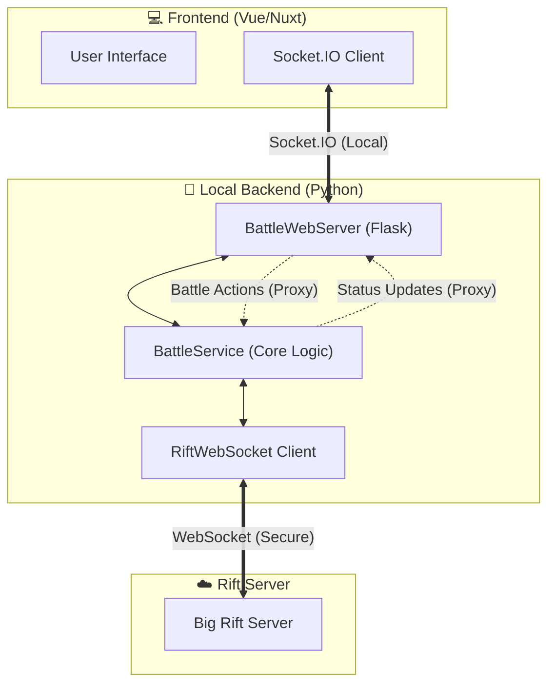

# Battle Camera Architecture

This document explains the communication flow between the Frontend, our Local Backend, and the centralized Rift Server.

## 🔄 Overview (Proxy Architecture)

To simplify the connection logic and centralized control, the **Frontend never connects directly to the Rift Server**. Instead, everything goes through our local **Python Backend**.

### 📊 Communication Flow Schema

---

## 🛠 Component Roles

| Component | Responsibility |
| :--- | :--- |
| **Frontend** | Displays the UI. Connects **ONLY** to the Local Backend (`http://localhost:5010`). Sends actions (attacks) and receives state updates via `socket.io`. |
| **Local Backend** | Acts as the **Brain & Proxy**. It processes images (KNN/AI), manages local state, and acts as a bridge. |
| **Rift Server** | The central authority (Game Master). Receives images/actions from Backend, sends back global game state. |

## 📡 Data Flow Details

### 1. Receiving Updates (Rift -> Frontend)
1. **Rift Server** sends a state update (JSON) to `RiftWebSocket`.
2. `BattleService` receives the update.
3. `BattleService` broadcasts the state to the **Frontend** via `socket.io` (`status` event).
4. **Frontend** updates the UI (Boss HP, Game Phase, etc.).

### 2. Sending Actions (Frontend -> Rift)
1. **Frontend** detects an action (e.g., "Attack").
2. **Frontend** sends `proxy_to_rift` event to **Local Backend**.
3. `BattleWebServer` receives the event and passes it to `BattleService`.
4. `BattleService` forwards the raw payload to **Rift Server**.

### 3. Image Processing (Camera -> AI -> Rift)
1. **Frontend** sends a Camera Frame to Backend.
2. `BattleService` processes it (KNN Recognition -> AI Generation).
3. If valid, `BattleService` sends the **Generated Image** to **Rift Server**.
4. Simultaneously, it sends the result back to **Frontend** for preview.

---

## 🚀 Key Benefits
*   **Security**: API Keys (Fal.ai) stay on the backend.
*   **Simplicity**: Frontend has only **one** socket connection to manage.
*   **Stability**: If internet drops, local backend remains responsive (for debug/preview).
