# On veut faire quoi ?

En gros on a tout un systeme, trop gros.

```mermaid
flowchart LR

%% --- Rift Operation ----------------------------------------------------------
subgraph ro[Rift Operation]

    server[Transit Server]
    llm_server[LLM Server]

    subgraph stranger[Stranger]
        esp32_1[ESP32 Parent]
        rfid_for_scrabble[RFID SCRABBLE]
        esp32_2[ESP32 Enfant]
        raspberry[Raspberry Parent]
        projecteur[Projecteur]

        subgraph pinguin[Pinguin]
            micro_pinguin[Microphone]
            haut_parleur[Haut parleur]
        end
    end


    subgraph imagination[Imagination]
        subgraph animals[Animals]
            esp32_4[ESP32 Enfant]
            camera_animals[Camera]
            haut_parleur_animals[Haut parleur]
        end
        cervomoteur[Cervomoteur]
        imaginationRfid[Capteur RFID]
        rpiParent[Raspberry Parent]
        projecteur2[Projecteur Parent]
        enceinte[Enceinte]
        lightsensor[Light sensor]
        cervomoteur2[Cervomoteur]
        ledPa[Led]
    end

    subgraph depth[Depth]
        esp32_depth_1[ESP32 Enfant]
        esp32_depth_2[ESP32 Parent]

        button_depth_1[Bouton x4]
        haut_parleur_depth[Haut Parleur Enfant]
        cervo_moteur_faille[Cervo moteur pour faille]

        button_depth_2[Bouton x4]
        led_depth[Led x4]
        cervo_moteur_faille_2[Cervo moteur pour faille]
    end

    subgraph rift_table[Rift Table]
        esp32_table_1[ESP32 Table Enfant]
        esp32_table_2[ESP32 Table Parent]

        capt_rfid_1[Capteur RFID x3]
        capt_rfid_2[Capteur RFID x3]
    end

    subgraph wall[Wall]
        raspberry_wall[Raspberry]
        leds[Leds]
        haut_parleur_wall[Haut parleur]
    end

    subgraph Ending
        pc[Computer mac or whatever]
        camera_1[Camera]
        camera_2[Camera]
        led_ending[Led]
        button_ending_1[Button]
        button_ending_2[Button]
    end
end


%% ======================= CONNECTIONS =====================================

%% Rift Operation main links
esp32_1 --> server
llm_server --> server

rfid_for_scrabble --> esp32_1

esp32_2 --> server
micro_pinguin --> esp32_2
haut_parleur --> esp32_2

raspberry --> server
raspberry --> projecteur

%% Imagination links
esp32_4 --> camera_animals
esp32_4 --> haut_parleur_animals
esp32_4 --> server

esp32_4 --> cervomoteur
esp32_4 --> imaginationRfid

rpiParent --> ledPa
rpiParent --> cervomoteur2
rpiParent --> lightsensor
rpiParent --> enceinte
rpiParent --> projecteur2
rpiParent --> server

esp32_depth_1 --> button_depth_1
esp32_depth_1 --> haut_parleur_depth
esp32_depth_1 --> cervo_moteur_faille

esp32_depth_2 --> button_depth_2
esp32_depth_2 --> led_depth
esp32_depth_2 --> cervo_moteur_faille_2

esp32_depth_1 --> server
esp32_depth_2 --> server


esp32_table_1 --> capt_rfid_1
esp32_table_2 --> capt_rfid_2

esp32_table_1 --> server
esp32_table_2 --> server


raspberry_wall --> leds
raspberry_wall --> haut_parleur_wall

raspberry_wall --> server

camera_1 --> pc
camera_2 --> pc
led_ending --> pc
button_ending_1 --> pc
button_ending_2 --> pc

pc --> server
```



> Et nous on va faire un json a partir de ca pour savoir ce qui passe par le serveur de transaction (transac serveur lol)

# Notre cher JSON

Bonjour, voici le json tel que nous le pensons ahah ! Il va être constitué de plusieurs partounes !

## Rift table

```json
"children_rift_part_count": int | null
"parent_rift_part_count": int | null
```

## Step 1 - Stranger

> `start_system` permet de lancer l'intégralité du system

```json
"start_system": bool | null,
"recognized_stranger_name": bool | null,
"pinguin_micro": base64 (chunk of 2500ms) | null
"pinguin_audio": base64 (full audio) | null
```

> `recognized_stranger_name` va simplement faire activer les servo moteurs et modifier ce qui est affiché avec le projecteur. C'est le signal de fin.

## Step 2 - Depth

> Se lance quand `children_rift_part_count` + `parent_rift_part_count` == 2

```json 
"step_1_parent_sucess": bool | null,
"step_2_parent_sucess": bool | null,
"step_3_parent_sucess": bool | null,
"step_1_enfant_sucess": bool | null,
"step_2_enfant_sucess": bool | null,
"step_3_enfant_sucess": bool | null
```

## Step 3 - Imagination

> Se lance quand `children_rift_part_count` + `parent_rift_part_count` == 4

```json
"torch_scanned": bool | null,
"cage_is_on_monster": bool | null
```

## Step 4 - Ending

> Se lance quand `children_rift_part_count` + `parent_rift_part_count` == 6

```json
"rien" (et oui.)
```

> Bah du coup on a rien ici.

## Scenographie

```json
"preset_stranger": bool | null,
"preset_depth": bool | null,
"preset_imagination": bool | null,
"preset_ending": bool | null,
```

> Quelle belle journée, aussi simple que ça finalement lol.

# Le JSON Complet 

```json
{
    // Rift table
    "children_rift_part_count": int | null,
    "parent_rift_part_count": int | null,
    
    // Step 1 - Stranger
    "start_system": bool | null,
    "recognized_stranger_name": bool | null,
    "pinguin_micro": base64 (chunk of 2500ms) | null,
    "pinguin_audio": base64 (full audio) | null,
    
    // Step 2 - Depth
    "step_1_parent_sucess": bool | null,
    "step_2_parent_sucess": bool | null,
    "step_3_parent_sucess": bool | null,
    "step_1_enfant_sucess": bool | null,
    "step_2_enfant_sucess": bool | null,
    "step_3_enfant_sucess": bool | null,
    
    // Step 3 - Imagination
    "torch_scanned": bool | null,
    "cage_is_on_monster": bool | null,webs
    
    // Scenographie
    "preset_stranger": bool | null,
    "preset_depth": bool | null,
    "preset_imagination": bool | null,
    "preset_ending": bool | null
}
```