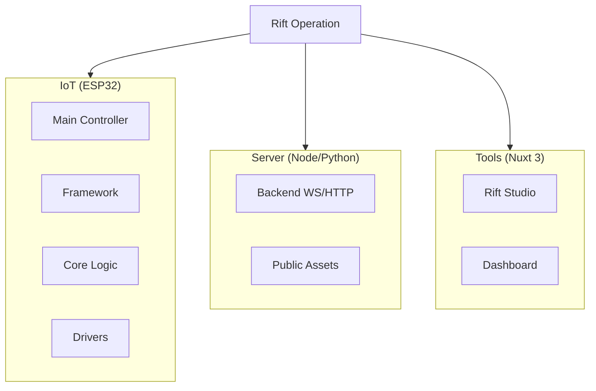

# Rift Operation

  

You are two special agents deployed in parallel worlds to repair a critical rift in the fabric of dream reality.

## The Agents

### Child Agent (Dream World)
- Infiltrated in the domain of sweet and colorful dreams
- Uses innocence and creativity to navigate dreamscapes
- Reporter of positive anomalies and happiness distortions

### Parent Agent (Nightmare World)
- Operator in the dark territories of nightmares
- Masters protection and the resolution of deep fears
- Guardian of the thresholds between the conscious and unconscious

### Joint Mission
The two agents must collaborate to identify the rift threatening to permanently merge the worlds of dreams and nightmares. Their perfect synchronization is essential to maintain the fragile balance of dream reality.

## Mission Context

A critical rift has opened between the worlds of dreams and nightmares. Faulty IoT devices are creating disturbances in the dream flow, threatening to merge these two parallel realities. Your team must intervene to restore the fragile balance.

## Project Structure

- **iot/** : MicroPython code for ESP32
  - `esp/src/Framework` : Reusable libs
  - `esp/src/Core` : Business logic (Stranger, Lost, Depth...)
- **server/** : Python/FastAPI server handling WebSockets
  - `public/` : Static assets (clients.html, logos...)
- **tools/** : Nuxt 3 application for development and monitoring
  - `app/` : Vue 3 Source
  - `server/` : Nuxt API routes

## Technical Features

### Central Server
- WebSocket server receiving messages from IoT devices
- Automatically broadcasts each message to all connected devices
- Runs on port 3000 with WebSockets on `/ws`

### Device Monitoring
- Real-time web interface showing all connected devices
- REST API to retrieve the list of active devices
- Admin page accessible on `http://localhost:3000`

### Communication Protocol
- JSON data exchange between devices
- Standardized format for mission reports
- Automatic state synchronization

## Mission Deployment

### Phase 1: The Strangers (Initial Encounter)
- The child discovers the first signs of the rift in dreams
- The parent identifies disturbances in nightmares
- Establishment of the first contact between the two worlds via connected devices

### Phase 2: The Sharks (Dangerous Navigation)
- The child learns to navigate unstable dream currents
- The parent faces creatures born from faulty nightmares
- Movement coordination between the two agents and monitoring of critical devices

### Phase 3: The Witch (Revelation)
- The child discovers the creative power of pure dreams
- The parent learns to transform nightmares into allies
- In-depth analysis of connected device data

### Phase 4: The Resolution (Final Healing)
- Perfect synchronization between dream and nightmare
- Definitive repair of the rift via coordinated devices
- Restoration of dream balance and secure disconnection

## Architecture

The system relies on a modular architecture:

- **Framework**: Reusable classes for HTTP/WebSocket management
- **Core**: Business logic specific to the Rift Operation mission
- **Server**: Unified server handling HTTP and WebSocket on the same port

Each IoT device becomes a monitoring point in the parallel worlds. The child and parent must synchronize their actions to identify signs of the rift and coordinate the repair of the dream fabric, maintaining the fragile balance between dreams and nightmares.
