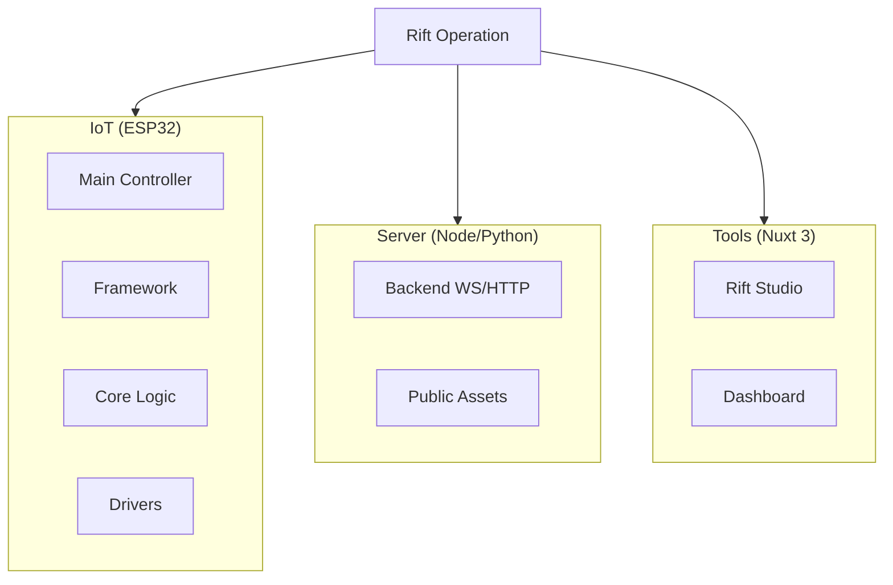

# Rift Operation

  

Vous êtes deux agents spéciaux déployés dans les mondes parallèles pour réparer une faille critique dans le tissu de la réalité onirique.

## Les Agents

### Agent Enfant (Monde des Rêves)
- Infiltré dans le domaine des rêves doux et colorés
- Utilise l'innocence et la créativité pour naviguer les paysages oniriques
- Rapporteur des anomalies positives et des distorsions du bonheur

### Agent Parent (Monde des Cauchemars)
- Opérateur dans les territoires sombres des cauchemars
- Maîtrise la protection et la résolution des peurs profondes
- Gardien des seuils entre le conscient et l'inconscient

### Mission Commune
Les deux agents doivent collaborer pour identifier la faille qui menace de fusionner définitivement les mondes des rêves et des cauchemars. Leur synchronisation parfaite est essentielle pour maintenir l'équilibre fragile de la réalité onirique.

## Contexte de la Mission

Une faille critique s'est ouverte entre les mondes des rêves et des cauchemars. Des appareils IoT défaillants créent des perturbations dans le flux onirique, menaçant de fusionner ces deux réalités parallèles. Votre équipe doit intervenir pour restaurer l'équilibre fragile.

## Structure du Projet

- **iot/** : Code MicroPython pour les ESP32
  - `esp/src/Framework` : Libs réutilisables
  - `esp/src/Core` : Logique métier (Stranger, Lost, Depth...)
- **server/** : Serveur Python/FastAPI gérant les WebSockets
  - `public/` : Assets statiques (clients.html, logos...)
- **tools/** : Application Nuxt 3 pour le développement et monitoring
  - `app/` : Source Vue 3
  - `server/` : API routes Nuxt

## Fonctionnalités Techniques

### Serveur Central
- Serveur WebSocket qui reçoit les messages des appareils IoT
- Diffuse automatiquement chaque message à tous les appareils connectés
- Fonctionne sur le port 3000 avec les WebSockets sur `/ws`

### Surveillance des Appareils
- Interface web en temps réel montrant tous les appareils connectés
- API REST pour récupérer la liste des appareils actifs
- Page d'administration accessible sur `http://localhost:3000`

### Protocole de Communication
- Échange de données en JSON entre les appareils
- Format standardisé pour les rapports de mission
- Synchronisation automatique des états

## Déploiement de la Mission

### Phase 1 : Les Étrangers (Rencontre Initiale)
- L'enfant découvre les premiers signes de la faille dans les rêves
- Le parent identifie les perturbations dans les cauchemars
- Établissement du premier contact entre les deux mondes via les appareils connectés

### Phase 2 : Les Requins (Navigation Dangereuse)
- L'enfant apprend à naviguer dans les courants oniriques instables
- Le parent affronte les créatures nées des cauchemars défaillants
- Coordination des mouvements entre les deux agents et surveillance des appareils critiques

### Phase 3 : La Sorcière (Révélation)
- L'enfant découvre le pouvoir créateur des rêves purs
- Le parent apprend à transformer les cauchemars en alliés
- Analyse approfondie des données des appareils connectés

### Phase 4 : La Résolution (Guérison Finale)
- Synchronisation parfaite entre rêve et cauchemar
- Réparation définitive de la faille via les appareils coordonnés
- Rétablissement de l'équilibre onirique et déconnexion sécurisée

## Architecture

Le système repose sur une architecture modulaire :

- **Framework** : Classes réutilisables pour la gestion HTTP/WebSocket
- **Core** : Logique métier spécifique à la mission Rift Operation
- **Server** : Serveur unifié gérant HTTP et WebSocket sur le même port

Chaque appareil IoT devient un point de surveillance dans les mondes parallèles. L'enfant et le parent doivent synchroniser leurs actions pour identifier les signes de la faille et coordonner la réparation du tissu onirique, maintenant l'équilibre fragile entre les rêves et les cauchemars.
