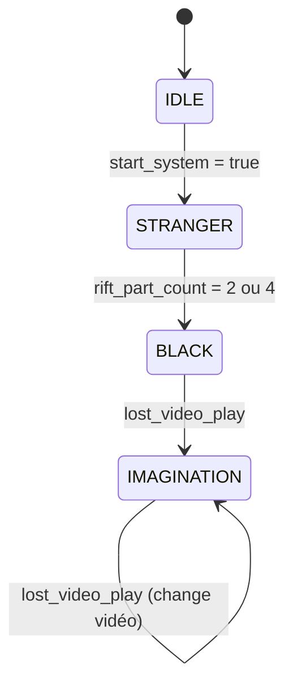

## Vue d'ensemble

Le système de **Vidéo Projection** est un composant central de l'expérience visuelle. Il gère l'affichage des vidéos immersives sur le projecteur principal, réagissant en temps réel aux commandes WebSocket du scénario.

La page est accessible via `/projection`.

## Machine d'États

Le système de projection suit une machine d'états stricte :



| État | Affichage | Trigger de Sortie |
| :--- | :--- | :--- |
| `IDLE` | Écran "SYSTEM IDLE" (vert/noir) | `start_system: true` |
| `STRANGER` | Lecture de `video-stranger.mp4` | `rift_part_count: 2` ou `4` |
| `BLACK` | Écran noir complet | `lost_video_play: "video1.mp4"` |
| `IMAGINATION` | Lecture des vidéos Lost | Nouveau `lost_video_play` |

## Protocole & Commandes

Le système répond aux champs suivants du protocole JSON Rift :

| Champ | Type | Description | Exemple |
| :--- | :--- | :--- | :--- |
| `start_system` | `boolean` | Lance l'expérience, joue `video-stranger.mp4` | `true` |
| `rift_part_count` | `number` | Compteur de progression (2 ou 4 = écran noir) | `2` ou `4` |
| `lost_video_play` | `string` | Fichier vidéo à jouer (module Imagination) | `"video1.mp4"` |

## Séquence Complète

1. **Démarrage** : La page affiche "SYSTEM IDLE", en attente WebSocket.
2. **Stranger** : Réception `start_system: true` → Lecture `video-stranger.mp4`.
3. **Transition** : Réception `rift_part_count: 2` → Écran noir (fin module Stranger).
4. **Imagination** : Réception `lost_video_play: "video1.mp4"` → Lecture vidéo Lost.
5. **Light Trigger** : Réception `lost_video_play: "video2.mp4"` → Changement de vidéo.

### Exemple de Payload Stranger → Black
```json
{
  "device_id": "RIFT_PANEL",
  "rift_part_count": 2
}
```

### Exemple de Payload Lost → Video
```json
{
  "device_id": "LOST-NIGHTMARE-ESP",
  "lost_video_play": "video2.mp4",
  "lost_light_is_triggered": true
}
```

## Fichiers Vidéo

Les fichiers doivent être dans le dossier `public/` :

| Fichier | Usage |
| :--- | :--- |
| `video-stranger.mp4` | Module Stranger (intro) |
| `video1.mp4` | Module Imagination - Ambiance initiale |
| `video2.mp4` | Module Imagination - Réaction lumière |

> **Note Technique** : Utilisez des vidéos encodées en **H.264 (MP4)**, résolution adaptée au projecteur (1920x1080 recommandé).

## Audio

L'audio des vidéos se débloque automatiquement au premier clic sur l'écran. Le système démarre en mode silencieux pour respecter les politiques autoplay des navigateurs.
