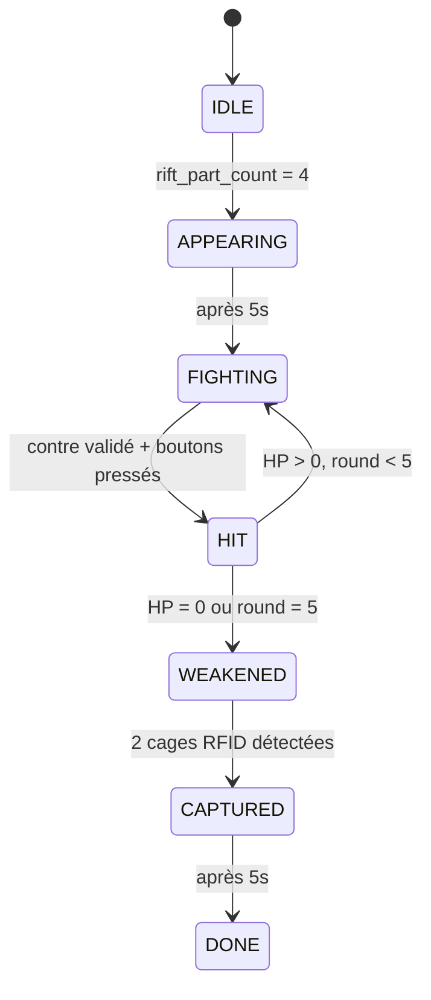

## Vue d'ensemble

Le module **Battle** est l'atelier final de l'expérience Rift. Après avoir collecté les 4 morceaux de faille, les deux agents affrontent l'Étranger dans un combat basé sur le timing et la reconnaissance d'objets dessinés.

La page de combat est accessible via `/battle`.

## Architecture

```mermaid
graph LR
    subgraph "Hardware"
        ESP_P[ESP Parent<br/>LED Bleu]
        ESP_C[ESP Enfant<br/>LED Rose]
    end
    
    subgraph "Swift App"
        CAM[2 Caméras]
        AI[Reconnaissance IA]
    end
    
    subgraph "Web"
        BATTLE[/battle]
    end
    
    ESP_P <--> SERVER[WebSocket<br/>Server]
    ESP_C <--> SERVER
    CAM --> AI --> SERVER
    SERVER <--> BATTLE
```

## Machine d'États



| État | LEDs | Action Requise |
| :--- | :--- | :--- |
| `IDLE` | Éteintes | Attente `rift_part_count=4` |
| `APPEARING` | Blanc → Rose/Bleu | Intro boss (5s) |
| `FIGHTING` | Couleur rôle | Dessiner le contre + appuyer bouton |
| `HIT` | Clignotement rapide | Animation de dégât |
| `WEAKENED` | Clignotement lent violet | Poser les cages RFID |
| `CAPTURED` | Vert fixe | Victoire ! |
| `DONE` | Éteintes | Fin de l'atelier |

## Déroulé Complet

### 1. Déclenchement
- Le serveur envoie `rift_part_count: 4`
- Les LEDs des deux ESP s'allument en **blanc**
- La page `/battle` affiche la vidéo d'apparition du boss

### 2. Transition (5 secondes)
- Après 5s, les LEDs changent de couleur :
  - **Parent** : Bleu foncé
  - **Enfant** : Rose
- La barre de vie du boss apparaît (5 segments)

### 3. Combat (5 rounds)
À chaque round :
1. Le boss lance une **attaque** (affiché sur l'écran)
2. Les agents doivent **dessiner le contre** devant les caméras
3. L'app Swift reconnaît le dessin et valide
4. Les **boutons arcade s'allument** quand le contre est validé
5. Les agents appuient sur les boutons **au bon moment**
6. Si réussi : dégâts au boss, HP -1

| Attaque | Contre |
| :--- | :--- |
| Lightning | Bouclier |
| Fire | Eau |
| Ice | Feu |
| Shadow | Lumière |
| Void | Épée |

### 4. Boss Affaibli
- Quand HP = 0, le boss est vulnérable
- Texte : *"L'Étranger est affaibli, posez les cages !"*
- Les agents doivent poser les **cages sur les capteurs RFID**

### 5. Capture
- Quand les 2 cages sont détectées → Boss capturé
- LEDs vertes, vidéo de victoire
- Texte final avec instructions

## Protocole JSON

### Clés Battle Simplifiées

```json
"battle_state": string | null,                    // idle, appearing, fighting, hit, weakened, captured, done
"battle_drawing_dream_recognised": bool | null,   // Dessin reconnu par caméra Dream
"battle_drawing_nightmare_recognised": bool | null, // Dessin reconnu par caméra Nightmare
"battle_hit_confirmed": bool | null,              // Hit confirmé
"battle_cage_nightmare": bool | null,             // Cage RFID détectée (Nightmare)
"battle_cage_dream": bool | null,                 // Cage RFID détectée (Dream)
"battle_video_play": string | null,               // Vidéo à jouer
"battle_music_play": string | null                // Musique à jouer
```

### Payloads Swift App → Serveur

```json
{
  "device_id": "battle-camera-mac",
  "battle_drawing_dream_recognised": true,
  "battle_drawing_nightmare_recognised": false
}
```

### Payloads ESP → Serveur

```json
{
  "device_id": "BATTLE-NIGHTMARE-ESP",
  "battle_state": "fighting",
  "battle_cage_nightmare": true
}
```

### Payloads Serveur → Page Web

```json
{
  "battle_state": "hit",
  "battle_hit_confirmed": true,
  "battle_video_play": "video-battle-hit.mp4"
}
```

## Hardware

### ESP32 (x2)

| Composant | Pin Nightmare | Pin Dream |
| :--- | :--- | :--- |
| LED Strip (WS2812B) | GPIO 27 | GPIO 27 |
| Arcade Button | GPIO 26 | GPIO 26 |
| Button LED | GPIO 25 | GPIO 25 |
| RFID (SPI) | Standard | Standard |

### Couleurs LED

| État | Couleur RGB |
| :--- | :--- |
| Intro | `(255, 255, 255)` Blanc |
| Nightmare | `(255, 105, 180)` Rose |
| Dream | `(25, 25, 112)` Bleu foncé |
| Hit | `(255, 200, 0)` Jaune |
| Affaibli | `(128, 0, 128)` Violet |
| Victoire | `(0, 255, 100)` Vert |

## Fichiers Vidéo

À placer dans `website/public/` :

| Fichier | Usage |
| :--- | :--- |
| `video-battle-appearing.mp4` | Apparition du boss |
| `video-battle-fighting.mp4` | Combat en cours |
| `video-battle-hit.mp4` | Boss touché |
| `video-battle-weakened.mp4` | Boss affaibli |
| `video-battle-captured.mp4` | Boss capturé |

## Fichiers Source

### ESP32
- `iot/esp/src/Core/Battle/` - Module Battle
- `iot/esp/src/Core/Controller/Battle/` - Controllers Nightmare/Dream

### Swift App (macOS)
- `iot/battle-mlx-cam/` - Application caméra
- `WebSocketManager.swift` - Connexion WebSocket
- `CameraManager.swift` - Gestion 2 caméras
- `ImageRecognitionService.swift` - Reconnaissance IA via Gemini

### Web
- `website/app/pages/battle.vue` - Page de combat

