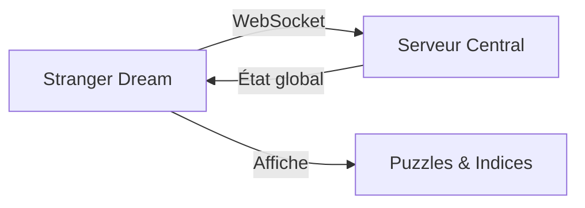

## Vue d'ensemble

**Stranger Dream** est une application Nuxt qui affiche les puzzles et indices pour guider les agents à travers l'expérience Rift Operation.

L'application est conçue pour être affichée sur un écran dédié, accessible aux agents pendant leur mission.

## Architecture



## Puzzles et Questions

Les questions sont configurées dans `app/config/questions.ts` :

### Étape 1 : Puzzle Chapeau
Un puzzle visuel où les agents doivent identifier le chapeau de l'Étranger :
- **Chapeau Étoile** → Lettre B
- **Chapeau Rayé** → Lettre i
- **Chapeau Rayures** → Lettre P

### Étape 2 : Dark Cosmo
> "Trouvez le point faible de Dark Cosmo et dites-le lui."

Les agents doivent découvrir la faiblesse de l'antagoniste.

### Étape 3 : Cosmo le Pingouin
> "Demandez gentiment la lettre à Cosmo le pingouin."

Interaction avec le module Pinguin.

### Étape 4 : Retour à la Lumière
> "Ramenez Dark Cosmo à la lumière dans son foyer."

Phase finale de capture.

## Lancement

```bash
cd iot/stranger-dream
npm install
npm run dev
```

## Fichiers Source

| Fichier | Description |
| :--- | :--- |
| `app/config/questions.ts` | Configuration des puzzles |
| `app/pages/index.vue` | Page principale d'affichage |
| `nuxt.config.ts` | Configuration Nuxt |
