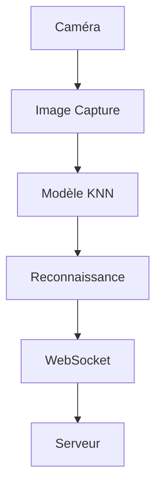

## Vue d'ensemble

**Lost KNN** est une application Swift native qui utilise l'apprentissage automatique (K-Nearest Neighbors) pour reconnaître les dessins des agents pendant le combat.

## Architecture



## Fonctionnalités

- **Capture en temps réel** : Utilise la caméra pour capturer les dessins
- **Reconnaissance KNN** : Classe les dessins parmi les catégories entraînées
- **WebSocket** : Envoie les résultats au serveur central
- **Son** : Feedback audio lors des reconnaissances

## Labels Reconnus

| Label | Description |
| :--- | :--- |
| `shield` | Bouclier (contre Lightning) |
| `water` | Eau (contre Fire) |
| `fire` | Feu (contre Ice) |
| `light` | Lumière (contre Shadow) |
| `sword` | Épée (contre Void) |

## Structure du Projet

```
iot/lost-knn/lost-knn/
├── ContentView.swift      # Vue principale
├── knn/                   # Logique KNN
├── model/                 # Modèles ML
├── sounds/                # Sons de feedback
├── websocket/             # Client WebSocket
└── utils/                 # Utilitaires
```

## Lancement

Ouvrir le projet dans Xcode et builder pour macOS ou iOS.

## Entraînement

Le modèle KNN est entraîné avec des échantillons de dessins. Pour ajouter de nouveaux labels :

1. Capturer des exemples via l'interface d'entraînement
2. Sauvegarder dans le dataset
3. Reconstruire le modèle
