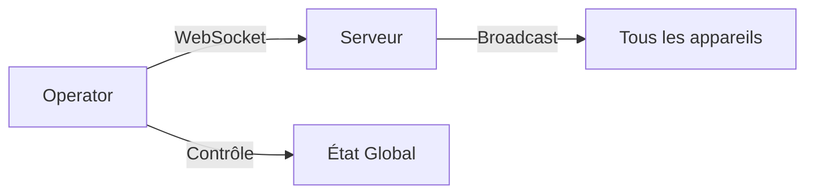

## Vue d'ensemble

**Operator** est l'interface de contrôle utilisée par l'opérateur pour gérer l'expérience Rift Operation en temps réel.

## Architecture



## Fonctionnalités

- **Vue d'ensemble** : Voir l'état de tous les appareils connectés
- **Contrôle manuel** : Déclencher des événements manuellement
- **Monitoring** : Suivre la progression des agents
- **Debug** : Accès aux logs et états raw

## Pages

| Route | Description |
| :--- | :--- |
| `/` | Dashboard principal |
| `/debug` | Vue de débogage |

## Lancement

```bash
cd iot/operator
npm install
npm run dev
```

## Configuration

Le fichier `config.js` contient les paramètres de connexion au serveur WebSocket.

## Fichiers Source

| Fichier | Description |
| :--- | :--- |
| `app/pages/index.vue` | Interface principale |
| `config.js` | Configuration serveur |
| `nuxt.config.ts` | Configuration Nuxt |
