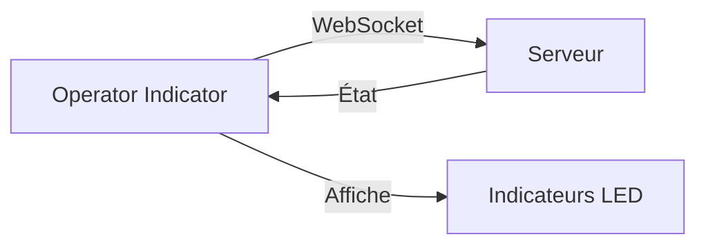

## Vue d'ensemble

**Operator Indicator** est une application d'affichage minimaliste qui montre les indicateurs de statut de l'expérience Rift à l'opérateur.

## Architecture



## Fonctionnalités

- **Indicateurs visuels** : Affichage coloré du statut
- **Temps réel** : Mise à jour instantanée via WebSocket
- **Minimaliste** : Interface épurée pour lecture rapide

## Pages

| Route | Description |
| :--- | :--- |
| `/` | Indicateur principal |
| `/full` | Vue étendue |

## Lancement

```bash
cd iot/operator-indicator
npm install
npm run dev
```

## Fichiers Source

| Fichier | Description |
| :--- | :--- |
| `pages/index.vue` | Indicateur principal |
| `pages/full.vue` | Vue étendue |
| `nuxt.config.ts` | Configuration |
